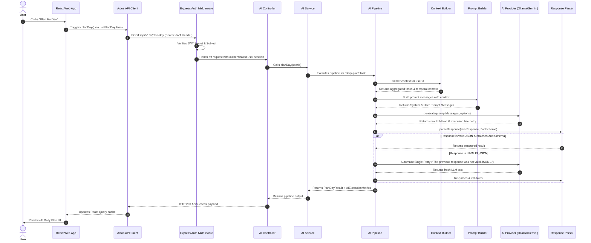
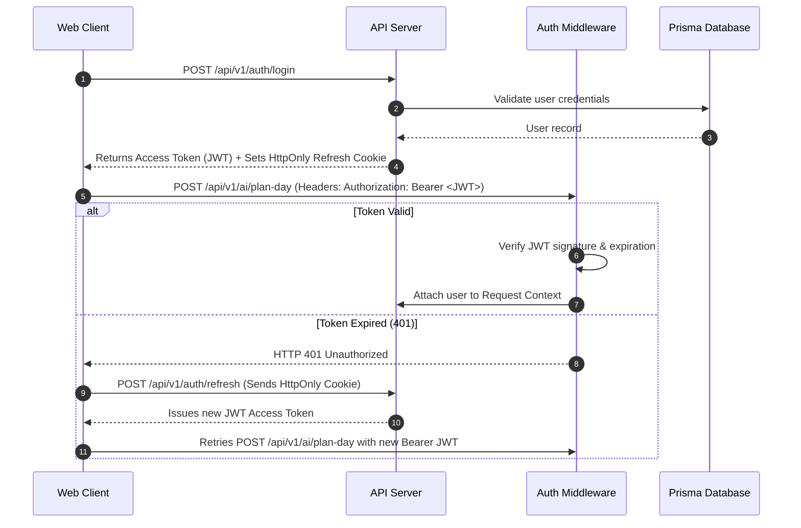
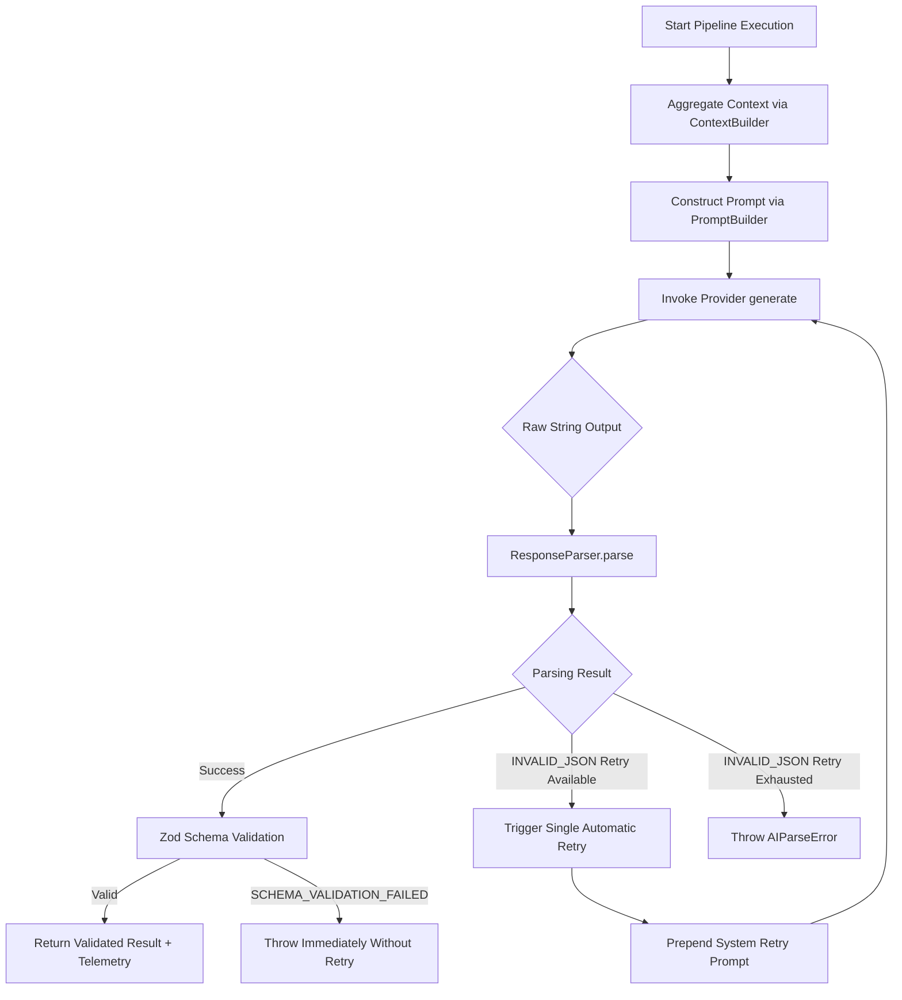
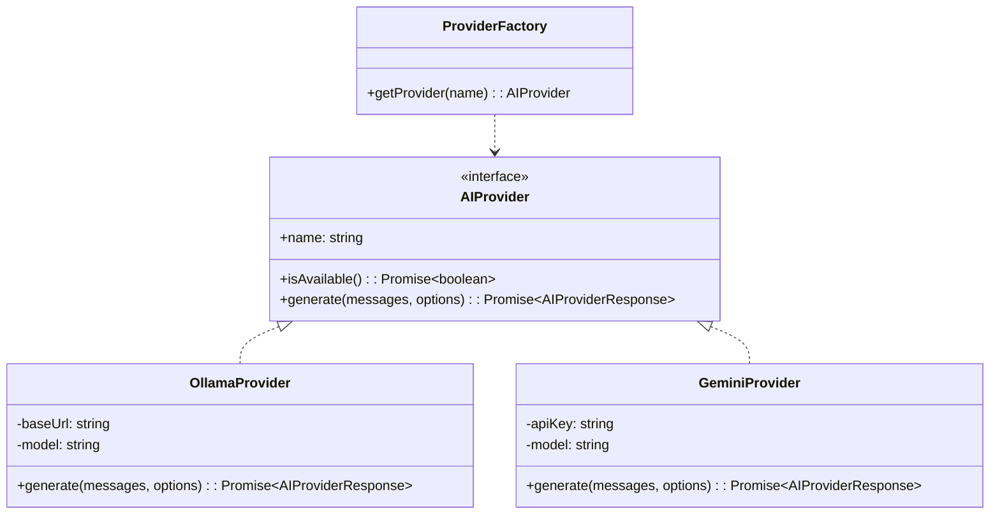

# AI Module Architecture

An enterprise-grade, modular, and provider-agnostic Artificial Intelligence architecture built for **AetherMind AI**. This system powers intelligent productivity features—such as **Plan My Day**—by contextually assembling user task data, engineering strict system prompts, orchestrating multi-provider LLM inference (local Ollama models and cloud Google Gemini), validating output against strict Zod schemas, and providing deterministic retry mechanisms and rich UI states.

---

## Table of Contents

- [Overview](#overview)
- [Features](#features)
- [High-Level Architecture](#high-level-architecture)
- [Folder Structure](#folder-structure)
- [End-to-End Request Flow](#end-to-end-request-flow)
- [Authentication Flow](#authentication-flow)
- [AI Pipeline](#ai-pipeline)
- [Context Builder](#context-builder)
- [Prompt Builder](#prompt-builder)
- [AI Provider Abstraction](#ai-provider-abstraction)
- [Ollama Provider](#ollama-provider)
- [Gemini Provider](#gemini-provider)
- [Response Parser](#response-parser)
- [Zod Validation](#zod-validation)
- [Error Handling](#error-handling)
- [Frontend Flow](#frontend-flow)
- [Performance](#performance)
- [Security](#security)
- [Logging](#logging)
- [Current Example](#current-example)
- [Future AI Features](#future-ai-features)
- [Lessons Learned](#lessons-learned)
- [Tech Stack](#tech-stack)
- [Conclusion](#conclusion)

---

## Overview

### Why AI Was Introduced
Modern task management applications often suffer from user cognitive overload: users create long lists of tasks but struggle to prioritize, schedule, and execute them effectively. AetherMind AI introduces an autonomous AI cognitive layer that converts disorganized task backlogs into structured, actionable, and context-aware daily execution plans.

### Current Feature: Plan My Day
The primary feature powered by this architecture is **Plan My Day**. It analyzes the user's active tasks, due dates, priority tiers, estimated completion times, and current temporal context to construct an optimal schedule, calculate a daily productivity score, highlight top priorities, and provide personalized productivity recommendations.

### Supported Providers
- **Ollama**: Local, privacy-first inference using open-source models such as `llama3.2:3b` and `qwen3`.
- **Google Gemini**: Cloud-based high-throughput inference using models like `gemini-1.5-flash` or `gemini-1.5-pro`.

### Future Extensibility
The pipeline and provider abstractions permit zero-friction integration of new models (e.g., Anthropic Claude, OpenAI GPT-4o, DeepSeek) and new intelligence features (e.g., AI Chat, Task Breakdown, Weekly Review) without modifying core controller or routing layers.

---

## Features

- **AI Daily Planner**: Context-aware schedule generation and task prioritization.
- **Local AI Support (Ollama)**: Privacy-preserving, offline-capable local LLM execution.
- **Cloud AI Support (Gemini)**: Ultra-fast cloud inference with high context limits.
- **Provider Abstraction**: Unified strategy pattern for swapping AI providers seamlessly.
- **Prompt Engineering**: Versioned prompt templates enforcing strict JSON output.
- **Context Builder**: Dynamic aggregation of user tasks, temporal metadata, and user preferences.
- **JSON Response Validation**: Double-pass Zod schema validation ensuring runtime type safety.
- **Automatic Retry Mechanism**: Single-pass auto-retry specifically targeted at `INVALID_JSON` parse errors.
- **Structured Parsing**: Robust extraction of JSON payloads from raw LLM output strings.
- **React Query Integration**: Declarative async state management with automatic refetching and error boundaries.
- **Secure Authentication**: JWT access token verification coupled with HttpOnly refresh cookies.
- **Execution Metrics**: Fine-grained telemetry tracking prompt versions, token consumption, and execution duration.

---

## High-Level Architecture

```text
┌────────────────────────────────────────────────────────────────────────┐
│                          React Web Application                         │
│   PlanMyDayDialog  ──>  usePlanDay()  ──>  aiService.planDay()        │
└───────────────────────────────────┬────────────────────────────────────┘
                                    │ HTTP POST /api/v1/ai/plan-day
                                    │ (Bearer JWT Token)
                                    ▼
┌────────────────────────────────────────────────────────────────────────┐
│                        Express API Gateway                             │
│   requireAuth Middleware  ──>  AiController.planDay()                  │
└───────────────────────────────────┬────────────────────────────────────┘
                                    │ delegates
                                    ▼
┌────────────────────────────────────────────────────────────────────────┐
│                            AiService                                   │
└───────────────────────────────────┬────────────────────────────────────┘
                                    │ executes
                                    ▼
┌────────────────────────────────────────────────────────────────────────┐
│                           AI Pipeline                                  │
│ ┌──────────────────┐  ┌──────────────────┐  ┌──────────────────────┐  │
│ │  ContextBuilder  │  │  PromptBuilder   │  │   ResponseParser     │  │
│ └────────┬─────────┘  └────────┬─────────┘  └──────────▲───────────┘  │
└──────────┼─────────────────────┼───────────────────────┼───────────────┘
           │                     │                       │
           ▼                     ▼                       │
   Gather User Tasks     Assemble System/User            │ Validate JSON
   & Temporal State      Prompt Templates                │ & Zod Schema
                                 │                       │
                                 ▼                       │
                     ┌───────────────────────┐           │
                     │   Provider Factory    │           │
                     └───────────┬───────────┘           │
                                 │                       │
                       ┌─────────┴─────────┐             │
                       ▼                   ▼             │
             ┌───────────────────┐ ┌───────────────────┐ │
             │   OllamaProvider  │ │  GeminiProvider   │─┘
             │  (llama3.2:3b)    │ │ (gemini-1.5-flash)│
             └───────────────────┘ └───────────────────┘
```

### Layer Responsibilities

1. **Presentation Layer (React Frontend)**: Manages dialog visibility, displays an animated loading experience with rotating progress messages and timer, and renders structured plan cards.
2. **Transport & Auth Layer (Axios & Express Middleware)**: Handles HTTP requests, injects Bearer JWT tokens, handles 401 token refreshes, and validates caller identity.
3. **Controller & Service Layer (`AiController` & `AiService`)**: Sanitizes API requests, delegates work to the pipeline, and formats uniform `ApiSuccess<T>` standard responses.
4. **Pipeline Layer (`AIPipeline`)**: Coordinates context gathering, prompt construction, provider invocation, response parsing, schema validation, and automatic retries.
5. **Context & Prompt Layer**: Transforms database records into structured LLM context and injects them into versioned system/user prompt templates.
6. **Provider Layer (`AIProvider`)**: Hides vendor-specific API differences behind a uniform execution contract (`generate()`).
7. **Parsing & Validation Layer (`ResponseParser` & `SchemaValidator`)**: Guarantees that raw LLM output strings match runtime Zod structural rules before reaching caller applications.

---

## Folder Structure

```text
apps/api/src/modules/ai/
├── ai.controller.ts            # Route handler exposing endpoints to Express
├── ai.routes.ts                # Express router mapping endpoints to auth middleware & controller
├── ai.service.ts               # Core module entry service wrapping pipeline execution
├── index.ts                    # Public barrel export for the AI module
├── context/
│   ├── context-builder.ts              # Orchestrator aggregating all context providers
│   ├── context-provider.interface.ts  # Contract interface for context sources
│   ├── context-registry.ts           # Central registry storing context provider instances
│   ├── context.types.ts              # TypeScript interfaces for task & system context
│   ├── index.ts                      # Context submodule barrel export
│   ├── settings-context.provider.ts  # Context provider for user settings & preferences
│   ├── system-context.provider.ts    # Context provider for backend system metadata
│   ├── task-context.provider.ts      # Context provider fetching user task backlog
│   ├── time-context.provider.ts      # Context provider for temporal & timezone data
│   └── user-context.provider.ts      # Context provider for user profile information
├── parser/
│   ├── index.ts                      # Parser submodule barrel export
│   ├── json-parser.ts                # Raw string JSON extractor handling markdown code blocks
│   ├── response-parser.ts            # Orchestrator running JSON parsing & Zod schema validation
│   ├── response.types.ts             # Parser result & telemetry interfaces
│   ├── schema-validator.ts           # Zod schema execution wrapper
│   └── schemas/                      # Concrete Zod schemas (e.g. daily-plan.schema.ts)
├── pipeline/
│   ├── ai-pipeline.ts                # Orchestrator managing flow, retry logic & metrics
│   ├── index.ts                      # Pipeline submodule barrel export
│   ├── pipeline-prompt.registry.ts   # Mapping between pipeline tasks and prompt templates
│   └── pipeline.types.ts             # Input/output pipeline execution types
├── prompt/
│   ├── index.ts                      # Prompt submodule barrel export
│   ├── prompt-builder.ts             # Assembles prompt context into final role messages
│   ├── prompt-registry.ts            # Registry storing registered prompt templates
│   ├── prompt-renderer.ts            # Interpolates variables into template strings
│   ├── prompt.types.ts               # Prompt role, template, and variable definitions
│   ├── system-prompts.ts             # Core system instructions enforcing strict JSON output
│   └── templates/                    # Concrete prompt templates (e.g. daily-plan.template.ts)
└── providers/
    ├── ai-provider.interface.ts      # Uniform interface for LLM vendors
    ├── gemini.provider.ts            # Google Gemini SDK implementation
    ├── ollama.provider.ts            # Local Ollama HTTP API implementation
    ├── provider.factory.ts           # Factory instantiating default/configured provider
    └── types.ts                      # Provider options, response, and metrics types
```

---

## End-to-End Request Flow



### Detailed Step Walkthrough

1. **User Action**: The user opens the task workspace and clicks **"Plan My Day"**.
2. **React Query Execution**: `usePlanDay()` hook checks cache freshness and triggers `planDay()` query function.
3. **HTTP Transport**: `apiClient` sends `POST /api/v1/ai/plan-day` with extended `timeout: 120000` (120s).
4. **JWT Injection**: Axios request interceptor injects `Authorization: Bearer <token>` from local storage.
5. **Express Authentication**: `requireAuth` middleware verifies the access token signature and attaches `request.user`.
6. **Controller Dispatch**: `AiController.planDay` extracts `request.user.id` and delegates execution to `AiService`.
7. **Service Orchestration**: `AiService` delegates work to `AIPipeline.execute()`.
8. **Context Collection**: `ContextBuilder` queries Prisma for user tasks, overdue items, priority tiers, and temporal metadata.
9. **Prompt Construction**: `PromptBuilder` interpolates context into `daily-plan.template.ts` and prepends strict `SYSTEM_PROMPT`.
10. **LLM Provider Execution**: `ProviderFactory` routes execution to `OllamaProvider` (or `GeminiProvider`).
11. **Raw LLM Output**: Model performs inference and returns a JSON string response.
12. **Parsing & Validation**: `ResponseParser` strips markdown fences, parses raw JSON, and validates structural compliance via Zod.
13. **API Response Delivery**: Express sends `HTTP 200` with standard `ApiSuccess` structure.
14. **UI Render**: React Query cache updates, loading screen completes, and the daily plan renders on screen.

---

## Authentication Flow



### Why Authentication Happens Prior to AI Execution
AI model generation is computationally expensive (high GPU utilization locally, API cost per token on cloud providers). Enforcing authentication at the API gateway layer prevents unauthenticated denial-of-service (DoS) attacks and ensures prompt context is isolated to the authenticated user's private data.

---

## AI Pipeline

The `AIPipeline` is the core orchestrator of the entire module.



### Pipeline Responsibilities
- **Context & Prompt Orchestration**: Dynamically builds inputs required by specific AI tasks.
- **Provider Switching**: Seamlessly executes requests against whichever `AIProvider` is active.
- **Transient Failure Recovery**: Implements targeted retry loops for malformed JSON without wasting tokens on non-retryable validation errors.
- **Telemetry Collection**: Measures provider execution time, prompt tokens, completion tokens, and pipeline duration.

---

## Context Builder

The quality of AI daily planning directly depends on the quality of context provided to the model.

### Collected Data Fields

| Context Source | Collected Fields | Purpose |
| :--- | :--- | :--- |
| **`TaskContextProvider`** | Incomplete tasks, Overdue tasks, Tasks due today, Tasks completed today, Priority tiers (`URGENT`, `HIGH`, `MEDIUM`, `LOW`), Estimated duration (minutes) | Core workload analysis and scheduling inputs |
| **`TimeContextProvider`** | Current date, Day of week, Current time, User timezone | Temporal anchoring for realistic schedule generation |
| **`UserContextProvider`** | User ID, Name, Email, Workspace ID | Personalized summary generation |
| **`SettingsContextProvider`**| Work hours start/end, Focus time preferences | Schedule constraint boundaries |

---

## Prompt Builder

Prompt construction combines immutable system instructions with task-specific templates.

### Strict System Prompt Enforcement

```typescript
export const SYSTEM_PROMPT = `
You are an AI productivity assistant.

Return ONLY valid JSON.
Do NOT return markdown.
Do NOT wrap JSON in \`\`\`.
Do NOT include explanations.
Do NOT include reasoning.
Do NOT include comments.
Do NOT include trailing commas.

Every property must use double quotes.
The response MUST be valid JSON parsable by JSON.parse().
Follow the schema exactly.
`;
```

### Template Example (`daily-plan.template.ts`)

```typescript
export const dailyPlanTemplate = {
  id: "daily-plan",
  version: "1.0.0",
  systemPrompt: SYSTEM_PROMPT,
  userPromptTemplate: `
Plan the daily schedule for {{userName}} on {{currentDate}} ({{dayOfWeek}}).

Tasks Context:
- Active Tasks: {{activeTasksCount}}
- Overdue Tasks: {{overdueTasksCount}}
- High Priority Tasks: {{highPriorityTasks}}

Format your response matching this exact JSON structure:
{
  "summary": "String",
  "priorities": ["String"],
  "schedule": [{"time": "HH:MM AM/PM", "task": "String"}],
  "recommendations": ["String"],
  "productivityScore": 85
}
`,
};
```

---

## AI Provider Abstraction



The system employs Dependency Inversion: business logic depends exclusively on the `AIProvider` interface, allowing runtime swapping of AI engines via environment configuration (`AI_PROVIDER=ollama` or `AI_PROVIDER=gemini`).

---

## Ollama Provider

### Local AI Architecture
`OllamaProvider` communicates directly with the local Ollama daemon via standard HTTP endpoints (`POST /api/generate`).

### Features & Configuration
- **Native JSON Mode**: Passes `format: "json"` in the request body to enforce JSON mode at the LLM decoding layer.
- **Timeout Management**: Uses `AbortController` configured with `OLLAMA_REQUEST_TIMEOUT_MS` (default: 180,000ms / 3 minutes).
- **Supported Models**: Optimized for `llama3.2:3b` and `qwen3`.

| Feature | Advantage | Disadvantage |
| :--- | :--- | :--- |
| **Local Ollama** | 100% Data Privacy, Zero API Cost, Offline Functionality | Requires Local GPU/CPU Hardware, Higher Latency (25-40s) |

---

## Gemini Provider

### Cloud AI Architecture
`GeminiProvider` wraps the official `@google/genai` SDK to execute cloud inference against Google's infrastructure.

### Features & Configuration
- **High Throughput**: Rapid response generation (~2-5 seconds).
- **Usage Telemetry**: Extracts token usage metrics directly from API response metadata.
- **Rate Limit Handling**: Translates Google API quota errors into typed `AIRateLimitError` exceptions.

| Feature | Advantage | Disadvantage |
| :--- | :--- | :--- |
| **Cloud Gemini** | Extremely Fast (2-5s), High Context Limits, Zero Local Compute Required | Requires Cloud API Key, External Network Dependency |

---

## Response Parser

Raw LLM responses are inherently unpredictable. The `ResponseParser` guarantees that string responses are converted into validated domain objects.

```typescript
export class ResponseParser {
  public parse<T>(rawText: string, schema: ZodSchema<T>): ParserResult<T> {
    // 1. Sanitize text (strip markdown fences like ```json ... ```)
    const cleanedText = JsonParser.extractJsonString(rawText);

    // 2. Parse JSON string
    const jsonResult = JsonParser.safeParse(cleanedText);
    if (!jsonResult.success) {
      return { success: false, errorType: "INVALID_JSON", rawText, error: jsonResult.error };
    }

    // 3. Validate Zod Schema
    const schemaResult = SchemaValidator.validate(jsonResult.data, schema);
    if (!schemaResult.success) {
      return { success: false, errorType: "SCHEMA_VALIDATION_FAILED", rawText, error: schemaResult.error };
    }

    return { success: true, data: schemaResult.data };
  }
}
```

---

## Zod Validation

Zod schema validation guarantees that incoming AI structures adhere strictly to expected application interfaces.

```typescript
export const dailyPlanSchema = z.object({
  summary: z.string().min(10),
  priorities: z.array(z.string()).min(1),
  schedule: z.array(
    z.object({
      time: z.string(),
      task: z.string(),
    })
  ),
  recommendations: z.array(z.string()),
  productivityScore: z.number().min(0).max(100),
});
```

---

## Error Handling

Custom exception classes ensure error handling remains predictable across layers.

| Error Class | Trigger Condition | HTTP Status | Retry Behavior |
| :--- | :--- | :--- | :--- |
| **`AIProviderError`** | Base exception for AI model errors | `500 Internal Server Error` | Non-retryable |
| **`AIProviderTimeoutError`** | Provider request exceeded configured timeout | `504 Gateway Timeout` | Non-retryable |
| **`AIRateLimitError`** | Provider quota or rate limit exceeded | `429 Too Many Requests` | Non-retryable |
| **`AIParseError`** | Raw response could not be parsed as JSON | `502 Bad Gateway` | Single automatic pipeline retry |
| **`AIResponseError`** | Response parsed but failed Zod schema validation | `502 Bad Gateway` | Non-retryable (prevents token waste) |
| **`UnauthorizedError`** | Missing or invalid Bearer JWT token | `401 Unauthorized` | Handled by frontend Auth refresh |

---

## Frontend Flow

The React frontend delivers a seamless user experience during long-running AI requests.

```text
               ┌─────────────────────────────┐
               │     User clicks button      │
               └──────────────┬──────────────┘
                              │
                              ▼
               ┌─────────────────────────────┐
               │    PlanMyDayDialog opens    │
               └──────────────┬──────────────┘
                              │
                              ▼
               ┌─────────────────────────────┐
               │  usePlanDay query executes  │
               └──────────────┬──────────────┘
                              │
               ┌──────────────┴──────────────┐
               ▼                             ▼
   isFetching = true             isError = true / isSuccess = true
┌──────────────────────────┐   ┌────────────────────────────────┐
│ Displays AI Loading Screen│   │ Hides Loader, renders Plan     │
│ - Pulsing Sparkles Icon  │   │ Success Cards OR Error Alert   │
│ - Rotating Status Text   │   └────────────────────────────────┘
│ - Indeterminate Progress │
│ - MM:SS Elapsed Timer    │
└──────────────────────────┘
```

### Key Frontend Components & Configurations
- **`PlanMyDayDialog`**: Controls modal lifecycle and renders state transitions.
- **`aiService.planDay()`**: Configured with `{ timeout: 120000 }` (120s) to prevent client-side Axios cancellation during local LLM generation.
- **`Progress` Component**: Displays smooth, accessible indeterminate loading animation.

---

## Performance

### Telemetry Benchmarks

| Metric | Local Ollama (`llama3.2:3b`) | Cloud Gemini (`gemini-1.5-flash`) |
| :--- | :--- | :--- |
| **Average Execution Time** | 25,000ms – 38,000ms | 1,800ms – 3,500ms |
| **Average Prompt Tokens** | ~350 – 450 tokens | ~350 – 450 tokens |
| **Average Completion Tokens** | ~100 – 180 tokens | ~100 – 180 tokens |
| **Configured HTTP Timeout** | 120,000ms (Client) / 180,000ms (Server) | 60,000ms |

---

## Security

1. **Strict Transport Security**: All protected endpoints require valid JWT authorization headers.
2. **Data Isolation**: Context queries are scoped strictly to `request.user.id`.
3. **Secrets Isolation**: API keys (e.g. `GEMINI_API_KEY`) are stored in server environment variables and never exposed to the client bundle.
4. **Prompt Injection Mitigation**: User inputs are injected into structured context templates rather than executed as direct instructions.

---

## Logging

Structured JSON logging captures end-to-end execution telemetry.

```json
{
  "timestamp": "2026-08-03T11:25:04.123Z",
  "level": "info",
  "message": "AI pipeline task executed successfully",
  "task": "daily-plan",
  "provider": "Ollama",
  "model": "llama3.2:3b",
  "executionTime": 25999,
  "tokenUsage": {
    "inputTokens": 358,
    "outputTokens": 96,
    "totalTokens": 454
  }
}
```

---

## Current Example

### Input User Task Backlog
- *"Refactor auth service"* (Priority: `HIGH`, Due: Today, Est: 60m)
- *"Fix API documentation typo"* (Priority: `LOW`, Due: Tomorrow, Est: 15m)

### Generated AI Output Payload
```json
{
  "summary": "Focus on high priority core architecture tasks during your morning focus block.",
  "priorities": [
    "Refactor auth service"
  ],
  "schedule": [
    { "time": "09:00 AM", "task": "Refactor auth service" },
    { "time": "11:00 AM", "task": "Fix API documentation typo" }
  ],
  "recommendations": [
    "Take a 10-minute break after the auth refactoring session."
  ],
  "productivityScore": 85
}
```

---

## Future AI Features

The current architecture cleanly accommodates future AI modules without structural changes:

- **`/ai/chat`**: Add `ChatContextProvider` and `chat.template.ts`.
- **`/ai/summarize`**: Add `summarize.template.ts` and `summarySchema`.
- **`/ai/weekly-review`**: Register `WeeklyReviewPipelineTask`.
- **`/ai/task-breakdown`**: Register `TaskBreakdownPipelineTask`.

---

## Lessons Learned

> [!NOTE]
> **Key Engineering Insights & Resolutions**

1. **Client Timeout Cancellation (`ECONNABORTED`)**:
   - *Problem*: Axios default 15s timeout aborted local Ollama inference requests at 15.00s.
   - *Solution*: Configured `timeout: 120000` (120s) specifically on long-running AI endpoints while updating standard client timeout to 60s.

2. **Malformed Local LLM JSON**:
   - *Problem*: Small local models (`llama3.2:3b`) occasionally returned markdown code fences or trailing commas.
   - *Solution*: Added `format: "json"` in `OllamaProvider`, strengthened system prompt constraints, and implemented an automatic single retry on `INVALID_JSON`.

3. **Validation Error Differentiation**:
   - *Problem*: Retrying schema validation errors wasted LLM tokens without improving results.
   - *Solution*: Differentiated `INVALID_JSON` (retryable) from `SCHEMA_VALIDATION_FAILED` (non-retryable).

---

## Tech Stack

- **Backend**: Node.js, Express, TypeScript, Prisma ORM
- **Frontend**: React, Vite, React Query, Tailwind CSS, Lucide Icons
- **AI Engine**: Ollama (`llama3.2:3b`), Google Gemini SDK (`@google/genai`)
- **Validation**: Zod
- **Authentication**: JWT, HttpOnly Cookies

---

## Conclusion

This AI module architecture provides a production-ready, extensible foundation for intelligent features in **AetherMind AI**. By isolating LLM vendors behind uniform provider abstractions, enforcing strict output schemas with deterministic retry logic, and offering a rich, responsive frontend user experience, the system achieves enterprise-grade reliability for both local and cloud AI inference.
