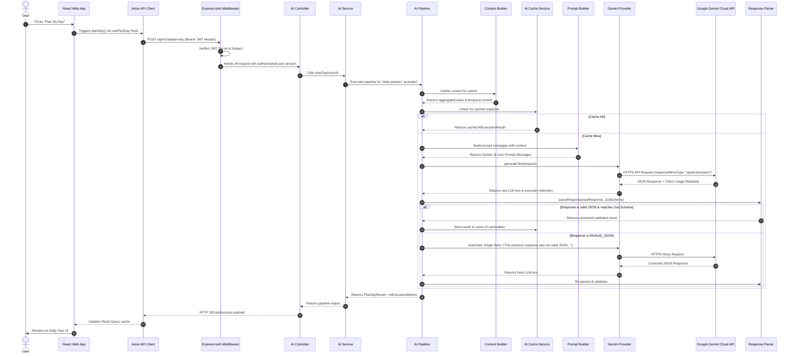
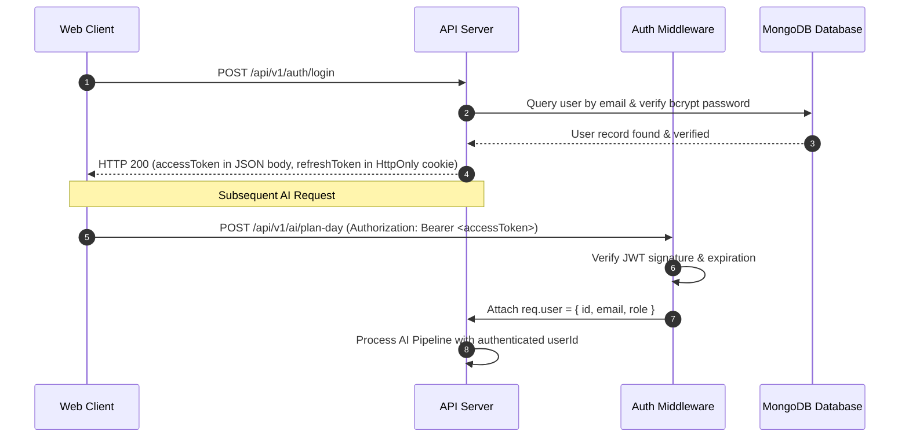
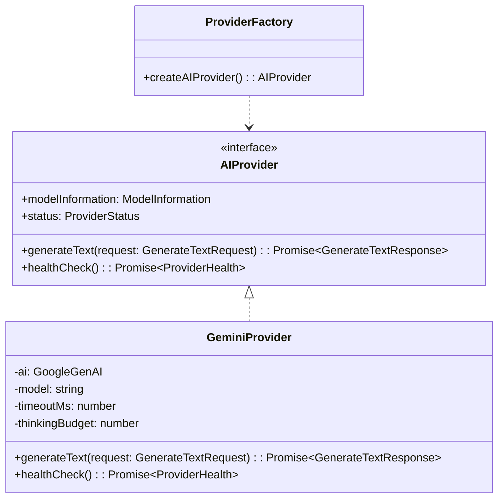

# AI Module Architecture

An enterprise-grade, modular, and cloud-first Artificial Intelligence architecture built for **AetherMind AI**. This system powers intelligent productivity features—such as **Plan My Day**, **Task Breakdown**, **Task Prioritization**, **Smart Reschedule**, **Weekly Review**, **Productivity Insights**, and **AI Assistant Chat**—by contextually assembling user task data, engineering strict system prompts, orchestrating cloud LLM inference with **Google Gemini 3.5 Flash**, validating output against strict Zod schemas, and providing deterministic retry mechanisms and rich UI states.

---

## Table of Contents

- [Overview](#overview)
- [Features](#features)
- [High-Level Architecture](#high-level-architecture)
- [Folder Structure](#folder-structure)
- [End-to-End Request Flow](#end-to-end-request-flow)
- [Authentication Flow](#authentication-flow)
- [AI Pipeline & Lifecycle](#ai-pipeline--lifecycle)
- [Context Builder](#context-builder)
- [Prompt Builder](#prompt-builder)
- [AI Provider Abstraction](#ai-provider-abstraction)
- [Gemini Provider](#gemini-provider)
- [In-Memory Caching (AICacheService)](#in-memory-caching-aicacheservice)
- [Response Parser & Schema Validation](#response-parser--schema-validation)
- [Zod Validation](#zod-validation)
- [Error Handling](#error-handling)
- [Frontend Flow](#frontend-flow)
- [Performance & Benchmarks](#performance--benchmarks)
- [Security & Secrets Management](#security--secrets-management)
- [Logging & Telemetry](#logging--telemetry)
- [Current Features & Examples](#current-features--examples)
- [Production Deployment & Serverless Considerations](#production-deployment--serverless-considerations)
- [Historical Migration Note](#historical-migration-note)
- [Tech Stack](#tech-stack)
- [Conclusion](#conclusion)

---

## Overview

### Why AI Was Introduced
Modern task management applications often suffer from user cognitive overload: users accumulate extensive backlogs of tasks but struggle to prioritize, schedule, and execute them effectively. AetherMind AI introduces an autonomous AI cognitive layer that converts disorganized task backlogs into structured, actionable, and context-aware daily execution plans.

### Current Features Powered by AI
- **Plan My Day**: Analyzes active tasks, due dates, priority tiers, estimated completion times, and temporal context to generate an optimized daily schedule, productivity score, top priorities, and actionable recommendations.
- **Task Breakdown**: Decomposes complex or intimidating tasks into atomic, dependency-ordered subtasks with realistic time estimates.
- **Task Prioritization**: Re-ranks the user's backlog considering urgency, overdue status, and effort.
- **Smart Reschedule**: Identifies overdue tasks and intelligently reschedules them to future dates while preventing daily overload.
- **Weekly Review**: Evaluates weekly performance metrics, identifies productivity bottlenecks, highlights achievements, and provides grounded coaching insights.
- **Productivity Insights**: Computes productivity strengths, patterns, weaknesses, and habit streaks from historical workspace data.
- **AI Assistant Chat**: Interactive conversational assistant strictly grounded in the user's workspace tasks and productivity context.

### Primary AI Provider
- **Google Gemini 3.5 Flash**: Cloud-based high-throughput inference using Google's `@google/genai` SDK with configurable reasoning/thinking budgets.

---

## Features

- **Autonomous Daily Planner**: Context-aware schedule generation and task prioritization.
- **Cloud AI Inference (Gemini 3.5 Flash)**: Ultra-fast cloud inference with high context limits (~1.5s–5s response times).
- **Thinking / Reasoning Budgets**: Configurable Gemini 3.5 Flash thinking token budgets (`none`, `low`, `medium`, `high`).
- **Provider Abstraction**: Decoupled interface architecture adhering to Dependency Inversion.
- **Prompt Engineering**: Versioned prompt templates enforcing strict JSON output and security boundaries.
- **Context Builder**: Dynamic aggregation of user tasks, temporal metadata, preferences, and workspace statistics.
- **JSON Response Validation**: Double-pass Zod schema validation ensuring runtime type safety.
- **Deterministic Auto-Retry**: Automatic single-pass self-correction retry targeted at `INVALID_JSON` parse errors.
- **Transient Fault Tolerance**: Exponential backoff with jitter on HTTP 429 rate limits and 503 service errors.
- **In-Memory Caching**: TTL-backed caching (`AICacheService`) for idempotent AI operations.
- **React Query Integration**: Declarative async state management with automatic caching, refetching, and error boundaries.
- **Secure Authentication**: JWT access token verification coupled with HttpOnly refresh cookies.
- **Comprehensive Telemetry**: Stage-by-stage timing breakdowns, token consumption, and model metadata.

---

## High-Level Architecture

```text
┌────────────────────────────────────────────────────────────────────────┐
│                          React Web Application                         │
│   PlanMyDayDialog  ──>  usePlanDay()  ──>  aiService.planDay()        │
└───────────────────────────────────┬────────────────────────────────────┘
                                    │ HTTP POST /api/v1/ai/plan-day
                                    │ (Bearer JWT Token)
                                    ▼
┌────────────────────────────────────────────────────────────────────────┐
│                        Express API Gateway                             │
│   requireAuth Middleware  ──>  AiController.planDay()                  │
└───────────────────────────────────┬────────────────────────────────────┘
                                    │ delegates
                                    ▼
┌────────────────────────────────────────────────────────────────────────┐
│                            AiService                                   │
└───────────────────────────────────┬────────────────────────────────────┘
                                    │ executes
                                    ▼
┌────────────────────────────────────────────────────────────────────────┐
│                           AI Pipeline                                  │
│ ┌──────────────────┐  ┌──────────────────┐  ┌──────────────────────┐  │
│ │  ContextBuilder  │  │  PromptBuilder   │  │   ResponseParser     │  │
│ └────────┬─────────┘  └────────┬─────────┘  └──────────▲───────────┘  │
│          │                     │                       │              │
│          ▼                     ▼                       │ Validate JSON│
│  Gather User Tasks     Assemble System/User            │ & Zod Schema │
│  & Temporal State      Prompt Templates                │              │
│          │                     │                       │              │
│          └──────────────┬──────┴───────────────────────┤              │
│                         ▼                              │              │
│               ┌───────────────────┐                    │              │
│               │  AICacheService   │ (Cache Hit?)       │              │
│               └─────────┬─────────┘                    │              │
│                         ▼ (Cache Miss)                 │              │
│               ┌───────────────────┐                    │              │
│               │ Provider Factory  │                    │              │
│               └─────────┬─────────┘                    │              │
│                         ▼                              │              │
│               ┌───────────────────┐                    │              │
│               │  GeminiProvider   │────────────────────┘              │
│               │ (gemini-3.5-flash)│                                   │
│               └─────────┬─────────┘                                   │
└─────────────────────────┼─────────────────────────────────────────────┘
                          │ HTTPS
                          ▼
             Google Gemini Cloud API
```

### Layer Responsibilities

1. **Presentation Layer (React Frontend)**: Manages dialog visibility, renders stateful loading indicators with animated progress, and presents structured plan cards.
2. **Transport & Auth Layer (Axios & Express Middleware)**: Handles HTTP requests, injects Bearer JWT tokens, handles 401 token refreshes, and validates caller identity.
3. **Controller & Service Layer (`AiController` & `AiService`)**: Sanitizes API requests, delegates work to the pipeline, and formats uniform `ApiSuccess<T>` responses.
4. **Pipeline Layer (`AIPipeline`)**: Coordinates context gathering, cache checks, prompt construction, provider invocation, response parsing, schema validation, and automatic retries.
5. **Context & Prompt Layer**: Transforms database records into structured LLM context and injects them into versioned system/user prompt templates.
6. **Provider Layer (`AIProvider` & `GeminiProvider`)**: Manages model interaction, thinking budgets, structured output modes, and transient retries via `@google/genai`.
7. **Parsing & Validation Layer (`ResponseParser` & `SchemaValidator`)**: Guarantees that raw LLM output strings match runtime Zod structural rules before reaching caller applications.

---

## Folder Structure

```text
apps/api/src/modules/ai/
├── ai.controller.ts            # Route handlers exposing AI endpoints to Express
├── ai.routes.ts                # Express router mapping endpoints to auth middleware & controller
├── ai.service.ts               # Core module entry service wrapping pipeline execution
├── index.ts                    # Public barrel export for the AI module
├── cache/
│   ├── ai-cache.service.ts     # In-memory TTL cache for deterministic AI requests
│   └── index.ts
├── context/
│   ├── context-builder.ts              # Orchestrator aggregating all context providers
│   ├── context-provider.interface.ts  # Contract interface for context sources
│   ├── context-registry.ts           # Central registry storing context provider instances
│   ├── context.types.ts              # TypeScript interfaces for task & system context
│   ├── index.ts                      # Context submodule barrel export
│   ├── settings-context.provider.ts  # Context provider for user settings & preferences
│   ├── system-context.provider.ts    # Context provider for backend system metadata
│   ├── task-context.provider.ts      # Context provider fetching user task backlog
│   ├── time-context.provider.ts      # Context provider for temporal & timezone data
│   └── user-context.provider.ts      # Context provider for user profile information
├── parser/
│   ├── index.ts                      # Parser submodule barrel export
│   ├── json-parser.ts                # Raw string JSON extractor handling markdown code blocks
│   ├── response-parser.ts            # Orchestrator running JSON parsing & Zod schema validation
│   ├── response.types.ts             # Parser result & telemetry interfaces
│   ├── schema-validator.ts           # Zod schema execution wrapper
│   └── schemas/                      # Concrete Zod schemas (e.g. daily-plan.schema.ts)
├── pipeline/
│   ├── ai-pipeline.ts                # Orchestrator managing flow, retry logic & metrics
│   ├── index.ts                      # Pipeline submodule barrel export
│   ├── pipeline-prompt.registry.ts   # Mapping between pipeline tasks and prompt templates
│   └── pipeline.types.ts             # Input/output pipeline execution types
├── prompt/
│   ├── index.ts                      # Prompt submodule barrel export
│   ├── prompt-builder.ts             # Assembles prompt context into final role messages
│   ├── prompt-registry.ts            # Registry storing registered prompt templates
│   ├── prompt-renderer.ts            # Interpolates variables into template strings
│   ├── prompt.types.ts               # Prompt role, template, and variable definitions
│   ├── system-prompts.ts             # Core system instructions enforcing strict JSON output
│   └── templates/                    # Concrete prompt templates (e.g. daily-plan.template.ts)
└── providers/
    ├── ai-provider.interface.ts      # Uniform interface for LLM vendors
    ├── gemini.provider.ts            # Google Gemini SDK (@google/genai) implementation
    ├── index.ts                      # Provider barrel export
    ├── provider.factory.ts           # Direct factory instantiating GeminiProvider
    └── types.ts                      # Provider options, response, and metrics types
```

---

## End-to-End Request Flow



---

## Authentication Flow



---

## AI Provider Abstraction



The system employs **Dependency Inversion**: domain logic and pipeline stages depend strictly on the `AIProvider` contract. `createAIProvider()` returns `GeminiProvider`, keeping provider initialization centralized and clean.

---

## Gemini Provider

### Cloud AI Architecture
`GeminiProvider` communicates with Google's cloud infrastructure via the official `@google/genai` SDK.

### Key Capabilities & Configurations
- **Model**: `gemini-3.5-flash` by default.
- **Thinking / Reasoning Budget**: Maps `AI_THINKING_LEVEL` configuration (`none`, `low`, `medium`, `high`) to token limits (0 to 2,048 tokens).
- **Structured Output**: Instructs the model using `config: { responseMimeType: "application/json" }`.
- **Transient Retry with Jitter**: Automatically retries HTTP 429 rate limits, 503 service errors, and network disconnects up to 2 times using exponential backoff with randomized jitter.
- **Fail-Fast**: Immediately throws non-transient errors (HTTP 401/403 invalid API keys, 404 missing model) without wasteful retry delays.
- **Timeout Management**: Bounded by `AI_GEMINI_TIMEOUT_MS` (default: 30,000ms).

---

## In-Memory Caching (AICacheService)

`AICacheService` provides in-memory TTL caching for AI operations.

- **Deterministic Cache Keys**: Generated by hashing `userId + promptId + stableSerializedContext`.
- **Configurable TTL**: Feature-specific cache expiration (e.g. 5 minutes for daily plans, 15 minutes for productivity insights).
- **Telemetry**: Caching state is reflected in execution metrics (`stageTimings.cached: true`).

---

## Response Parser & Schema Validation

Raw LLM responses are converted into strongly-typed domain objects:

```typescript
export class ResponseParser {
  public parse<T>(rawText: string, schema: ZodSchema<T>): ParserResult<T> {
    // 1. Sanitize text (strip markdown code fences if present)
    const cleanedText = JsonParser.extractJsonString(rawText);

    // 2. Parse JSON string
    const jsonResult = JsonParser.safeParse(cleanedText);
    if (!jsonResult.success) {
      return { success: false, errorType: "INVALID_JSON", rawText, error: jsonResult.error };
    }

    // 3. Validate Zod Schema
    const schemaResult = SchemaValidator.validate(jsonResult.data, schema);
    if (!schemaResult.success) {
      return { success: false, errorType: "SCHEMA_VALIDATION_FAILED", rawText, error: schemaResult.error };
    }

    return { success: true, data: schemaResult.data };
  }
}
```

---

## Zod Validation

Strict runtime validation guarantees that data structures conform to the expected domain interfaces:

```typescript
export const dailyPlannerResponseSchema = z.object({
  summary: z.string().min(1, "Summary is required"),
  priorities: z.array(z.string()).min(1, "At least one priority is required"),
  schedule: z.array(
    z.object({
      time: z.string().min(1, "Time block is required"),
      task: z.string().min(1, "Task description is required"),
    })
  ),
  recommendations: z.array(z.string()),
  productivityScore: z.number().int().min(0).max(100),
});
```

---

## Error Handling

| Error Class | Trigger Condition | HTTP Status | Error Code | Retry Behavior |
| :--- | :--- | :---: | :--- | :--- |
| **`AIRateLimitError`** | Gemini quota or rate limit exceeded (HTTP 429) | `429` | `AI_RATE_LIMIT` | Handled via exponential backoff |
| **`AIProviderTimeoutError`** | Request exceeded `AI_GEMINI_TIMEOUT_MS` | `504` | `AI_PROVIDER_TIMEOUT` | Non-retryable |
| **`AIProviderError`** | Gemini API authentication (401) or model error (404) | `401` / `404` / `500` | `AI_PROVIDER_ERROR` | Fail-fast |
| **`AIParseError`** | Raw response could not be parsed as JSON | `502` | `AI_RESPONSE_INVALID` | Single automatic pipeline retry |
| **`AIResponseError`** | Response parsed but failed Zod validation | `502` | `AI_RESPONSE_INVALID` | Non-retryable (prevents token waste) |
| **`UnauthorizedError`** | Missing or invalid Bearer JWT token | `401` | `UNAUTHORIZED` | Handled by frontend auth refresh |

---

## Performance & Benchmarks

### Telemetry Benchmarks (Google Gemini 3.5 Flash)

| Metric | Google Gemini 3.5 Flash |
| :--- | :--- |
| **Average End-to-End Latency** | 1,800ms – 4,500ms |
| **Average Prompt Tokens** | ~400 – 1,200 tokens |
| **Average Completion Tokens** | ~150 – 500 tokens |
| **Configured Server Timeout** | 30,000ms (`AI_GEMINI_TIMEOUT_MS`) |
| **Configured Client Timeout** | 120,000ms (`AI_REQUEST_TIMEOUT_MS`) |

---

## Security & Secrets Management

1. **Server-Side Isolation**: `GEMINI_API_KEY` is loaded strictly in server-side environment variables and is never exposed in client bundles or network responses.
2. **Context Sanitization**: Context builders exclude password hashes, tokens, session IDs, and administrative secrets from LLM payloads.
3. **Prompt Injection Mitigation**: All dynamic user inputs are wrapped in untrusted data tags (`<task_context>`, `<task_details>`, `<user_message>`), with explicit system directives forbidding instruction override.

---

## Logging & Telemetry

Structured JSON logs capture execution timing and token telemetry:

```json
{
  "timestamp": "2026-08-20T15:00:01.123Z",
  "level": "info",
  "message": "AI Pipeline Timing Breakdown",
  "promptId": "daily-planner",
  "userId": "6a771494d06ba6a4f43261c8",
  "provider": "Gemini",
  "model": "gemini-3.5-flash",
  "finishReason": "STOP",
  "outputTokenCount": 430,
  "inputTokenCount": 1031,
  "totalTokens": 1461,
  "contextTimeMs": 28,
  "promptTimeMs": 0,
  "llmTimeMs": 2510,
  "parseTimeMs": 2,
  "totalTimeMs": 2541
}
```

---

## Production Deployment & Serverless Considerations

- **Serverless Ready**: The AI subsystem operates purely via HTTPS outbound calls to Google's API, eliminating local process dependencies.
- **Zero Local Hardware Requirements**: No GPU/VRAM hardware, local daemons (`localhost:11434`), or model weight files are required on hosting infrastructure.
- **Architecture Compatibility**: Deployable to containerized platforms (Docker, AWS ECS, Google Cloud Run) and serverless environments.

---

## Historical Migration Note

> [!NOTE]
> *Historical Architecture Note*: Earlier iterations of AetherMind supported local model inference via Ollama (`llama3.2:3b`) alongside a proxy fallback orchestrator (`FallbackProvider`). To optimize response latency (reducing task execution times from ~30s down to ~2s), simplify operational maintenance, and enable serverless cloud deployments, the architecture was migrated to **Google Gemini 3.5 Flash exclusive inference**.

---

## Tech Stack

- **Backend**: Node.js, Express 5, TypeScript, Mongoose 9
- **Frontend**: React 19, Vite 8, TanStack Query 5, Tailwind CSS 4, Radix UI
- **AI Engine**: Google Gemini SDK (`@google/genai`) — `gemini-3.5-flash`
- **Validation**: Zod 3
- **Authentication**: JWT Access Tokens, HttpOnly Cookie Refresh Rotation

---

## Conclusion

This AI module architecture provides a production-grade, extensible, and high-performance foundation for **AetherMind AI**. By isolating LLM operations behind uniform provider abstractions, enforcing strict schema compliance with automatic retry logic, and leveraging cloud-native **Google Gemini 3.5 Flash** inference, the system delivers enterprise-grade reliability and lightning-fast user experiences.
