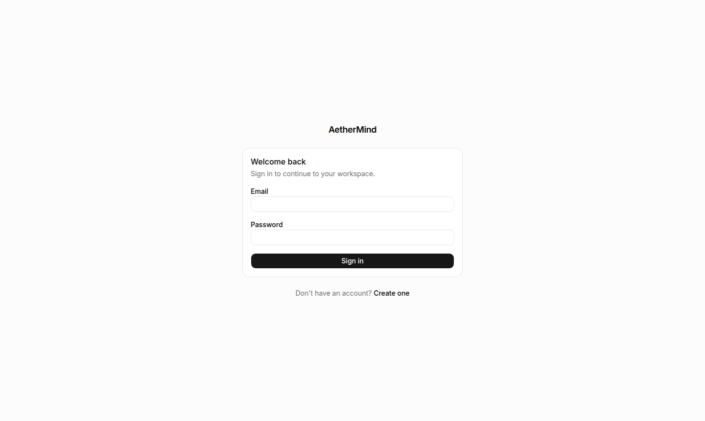
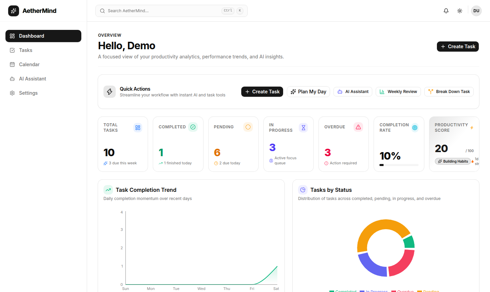
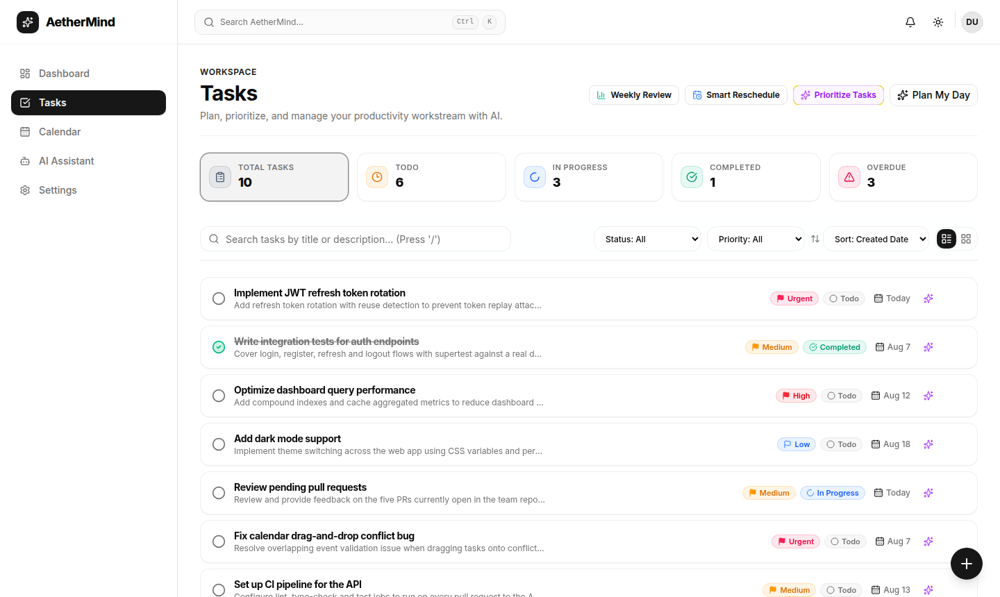
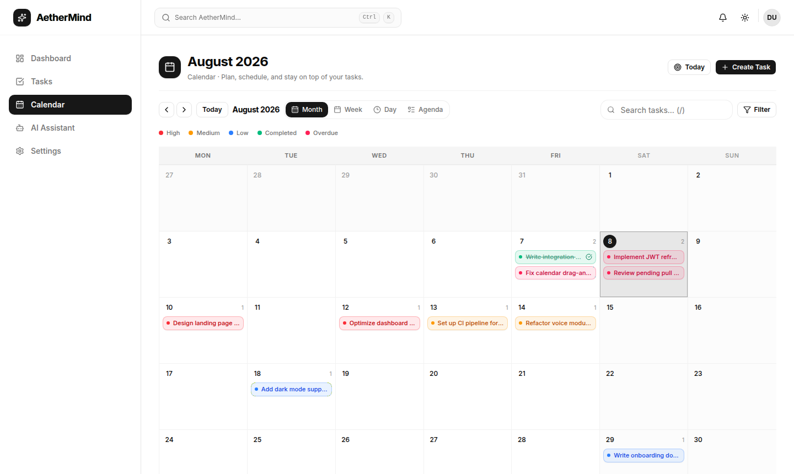
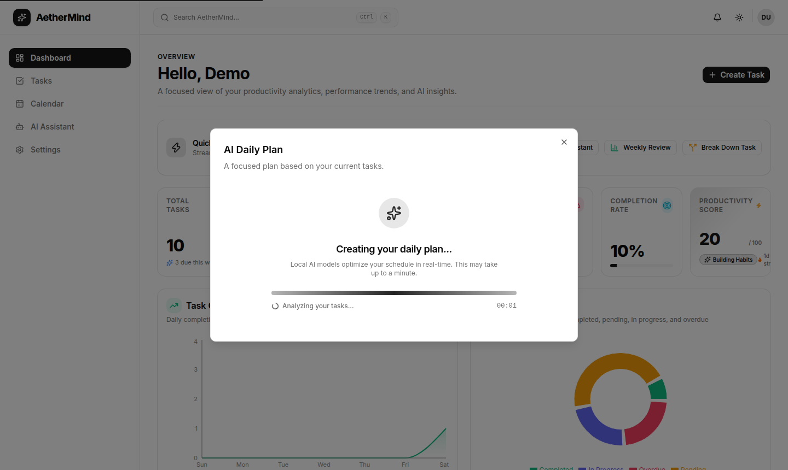
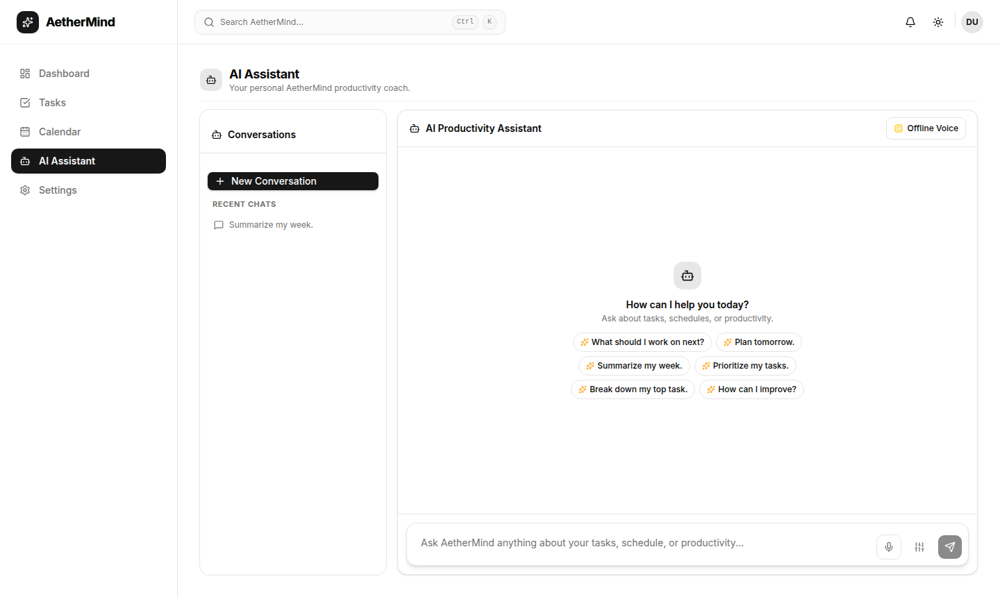

# AetherMind AI

> An AI-powered, full-stack task management platform that turns your task backlog into an actionable daily plan.

AetherMind AI is a production-grade monorepo application built with **React 19**, **Express**, **TypeScript**, **MongoDB**, and **Turborepo**. It combines classic task management (tasks, calendar, dashboards) with an autonomous AI cognitive layer that prioritizes work, plans your day, breaks down complex tasks, and reviews your week — powered by local **Ollama** models or cloud **Google Gemini**.

---

## Screenshots

| | |
|---|---|
| **Login** | **Dashboard** |
|  |  |
| **Tasks (Kanban)** | **Calendar** |
|  |  |
| **Plan My Day (AI)** | **AI Assistant** |
|  |  |

---

## Features

### Task Management
- Full task CRUD with statuses (TODO, IN_PROGRESS, COMPLETED), priorities (LOW → URGENT), tags, estimated time, start/due dates
- Kanban-style board with drag-and-drop reordering (`@dnd-kit`)
- Calendar workspace with drag-and-drop scheduling and multiple views
- Powerful filtering, sorting, and pagination via a reusable `MongooseQueryBuilder`

### AI Cognitive Layer
- **Plan My Day** — generates an optimal daily schedule, productivity score, top priorities, and recommendations
- **Weekly Review** — summarizes your week and surfaces insights
- **Task Breakdown** — splits large tasks into subtasks
- **Task Prioritization** — re-ranks your backlog based on due dates and priority
- **Smart Reschedule** — suggests new dates when tasks slip
- **Provider abstraction** — swap between local **Ollama** (`llama3.2:3b`, `qwen3`) and cloud **Gemini** via environment variables, no code changes
- Strict **Zod schema validation** on LLM output with automatic retry on `INVALID_JSON`

### AI Assistant
- Conversational chat with your task data
- Conversation history stored in MongoDB
- Suggestion chips, typing indicator, and voice input

### Notifications & Reminders
- Full-stack notification center with unread badge, filters, and slide-out drawer
- Automated reminder engine (overdue, due today/tomorrow, weekly review, productivity milestones)
- Browser notifications (Web Notification API) and toast notifications
- React Query polling + optimistic updates

### Platform
- JWT access tokens + HttpOnly refresh cookie rotation with reuse detection
- Role-based access control (`USER`, `ADMIN`)
- Dashboard with charts (Recharts), insights, and quick actions
- Dark mode theming, command palette (⌘K), keyboard shortcuts
- Voice module with offline settings
- Docker Compose for MongoDB

---

## Tech Stack

| Layer | Technology |
|---|---|
| **Frontend** | React 19, TypeScript, Vite 8, React Router 7, TanStack Query 5, Tailwind CSS 4, Radix UI, Framer Motion, Recharts, Zod |
| **Backend** | Node.js, Express 5, TypeScript, Mongoose 9, Zod, JWT, Helmet, CORS, compression |
| **AI** | Google Gemini SDK (`@google/genai`), Ollama HTTP API |
| **Data** | MongoDB 8 (local or Docker) |
| **Monorepo** | Turborepo 2, pnpm 9 workspaces |

---

## Monorepo Structure

```text
aethermind-ai/
├── apps/
│   ├── web/                      # React + Vite frontend
│   │   └── src/
│   │       ├── app/              # Router, layout, providers
│   │       ├── pages/            # Dashboard, Tasks, Calendar, Assistant, Settings
│   │       ├── features/         # auth, tasks, calendar, dashboard, ai, assistant,
│   │       │                     # notifications, command-palette, voice, theme
│   │       └── shared/           # Components, hooks, utils, lib
│   └── api/                      # Express backend
│       └── src/
│           ├── modules/          # auth, tasks, calendar, dashboard, ai, assistant,
│           │                     # notifications, activity, voice
│           ├── middlewares/      # auth, error handling, rate limiting
│           ├── database/         # MongoDB connection
│           └── shared/           # events, query builder, utils
├── docs/
│   ├── screenshots/              # Project screenshots
│   └── AUTH_SESSION.md
├── Ai-Architecture.md            # Deep dive into the AI module
├── docker-compose.yml            # MongoDB service
├── package.json                  # Turborepo root
└── turbo.json
```

### Request Flow

```text
React Web App
  │  POST /api/v1/ai/plan-day (Bearer JWT)
  ▼
Express API Gateway ── requireAuth ──> AiController
  ▼
AiService ──> AIPipeline
  ├── ContextBuilder  (tasks, time, user, settings)
  ├── PromptBuilder   (versioned system/user prompts)
  ├── ProviderFactory (Ollama | Gemini)
  ├── ResponseParser  (JSON extraction)
  └── Zod validation  (double-pass, auto-retry)
```

---

## Quick Start

### Prerequisites

- Node.js 18+ (LTS recommended)
- pnpm 9 (`npm install --global pnpm@9`)
- MongoDB (local install **or** Docker)

### 1. Clone and install

```bash
git clone <YOUR_REPOSITORY_URL>
cd aethermind-ai
pnpm install
```

### 2. Start MongoDB

**Option A — Docker** (recommended):

```bash
docker compose up -d
```

**Option B — Local MongoDB**: install MongoDB Community Server and verify with `mongosh --eval "db.runCommand({ ping: 1 })"` (expect `{ ok: 1 }`).

### 3. Configure the API

Create `apps/api/.env`:

```env
PORT=4000
WEB_ORIGIN=http://localhost:5173
NODE_ENV=development
MONGODB_URI=mongodb://127.0.0.1:27017/aethermind
JWT_ACCESS_SECRET=aethermind-development-access-secret-change-me
JWT_REFRESH_SECRET=aethermind-development-refresh-secret-change-me
JWT_ACCESS_EXPIRES_IN=15m
JWT_REFRESH_EXPIRES_IN=7d
```

**AI provider** — use local Ollama (default) or cloud Gemini:

```env
AI_PROVIDER=ollama
OLLAMA_BASE_URL=http://localhost:11434
OLLAMA_MODEL=llama3.2:3b
OLLAMA_REQUEST_TIMEOUT_MS=180000
```

```env
AI_PROVIDER=gemini
GEMINI_API_KEY=your-key
GEMINI_MODEL=gemini-1.5-flash
```

Start Ollama and pull the model:

```bash
ollama serve
ollama pull llama3.2:3b
```

### 4. Configure the web app

Create `apps/web/.env`:

```env
VITE_API_URL=http://localhost:4000/api/v1
VITE_APP_NAME=AetherMind
VITE_APP_VERSION=1.0.0
```

### 5. Run

```bash
pnpm dev
```

- Web app: http://localhost:5173
- API: http://localhost:4000
- Health check: http://localhost:4000/api/v1/health

### 6. Optional: seed demo data

```bash
pnpm --filter api seed
```

Creates a demo user and 10 sample tasks. Login with:

```text
Email:    demo@aethermind.ai
Password: DemoPassword123!
```

---

## Available Scripts

| Command | Description |
|---|---|
| `pnpm dev` | Run web + API in watch mode |
| `pnpm build` | Build all packages |
| `pnpm lint` | Lint all packages |
| `pnpm check-types` | Type-check all packages |
| `pnpm format` | Prettier format |
| `pnpm --filter api test` | Run API tests (Vitest + supertest) |
| `pnpm --filter api seed` | Seed demo user and sample tasks |

---

## API Overview

All endpoints are prefixed with `/api/v1` and (except auth/health) require `Authorization: Bearer <token>`.

| Method | Path | Description |
|---|---|---|
| `POST` | `/auth/register` | Create an account |
| `POST` | `/auth/login` | Sign in (returns access token + refresh cookie) |
| `POST` | `/auth/refresh` | Rotate refresh token |
| `POST` | `/auth/logout` | Sign out |
| `GET` | `/tasks` | Paginated, filterable task list |
| `POST` / `PATCH` / `DELETE` | `/tasks` `/tasks/:id` | Task CRUD |
| `GET` | `/calendar` | Calendar data for a date range |
| `POST` | `/calendar/reschedule` | Reschedule a task in the calendar |
| `GET` | `/dashboard/stats` | Aggregated metrics, charts, insights |
| `POST` | `/ai/plan-day` | Generate daily plan |
| `POST` | `/ai/tasks/:taskId/breakdown` | Break a task into subtasks |
| `POST` | `/ai/prioritize` | Re-rank tasks |
| `POST` | `/ai/reschedule` | Suggest new task dates |
| `POST` | `/ai/weekly-review` | Generate weekly review |
| `POST` | `/ai/productivity-insights` | Productivity insights |
| `POST` | `/ai/chat` | Chat with the AI assistant |
| `GET` / `POST` | `/assistant/conversations` | List / create conversations |
| `GET` | `/notifications` | Paginated notification list |
| `PATCH` | `/notifications/:id/read` | Mark notification read |
| `PATCH` | `/notifications/read-all` | Mark all as read |
| `GET` | `/notifications/unread-count` | Unread count |
| `GET` | `/health` | Service health |

---

## Learn More

- **[Ai-Architecture.md](Ai-Architecture.md)** — deep dive into the AI pipeline: context builders, prompt engineering, provider abstraction, Zod validation, retry logic, and telemetry
- **[docs/AUTH_SESSION.md](docs/AUTH_SESSION.md)** — authentication and session design
- **[apps/api/docs/api/README.md](apps/api/docs/api/README.md)** — API conventions and response envelope

---

## License

[MIT](LICENSE)
